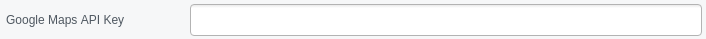
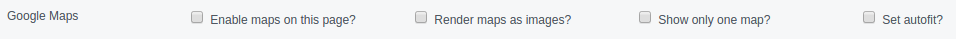
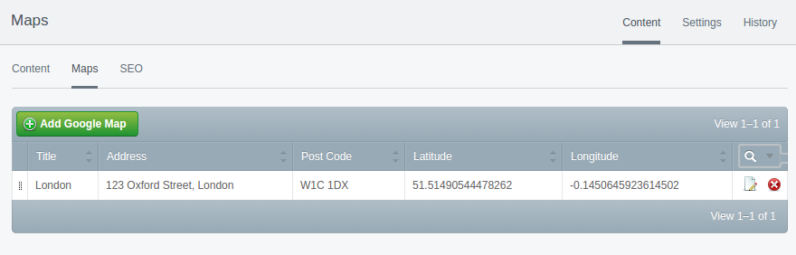
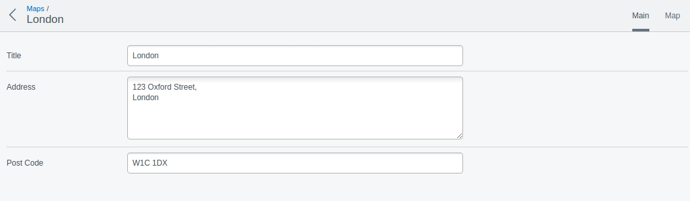
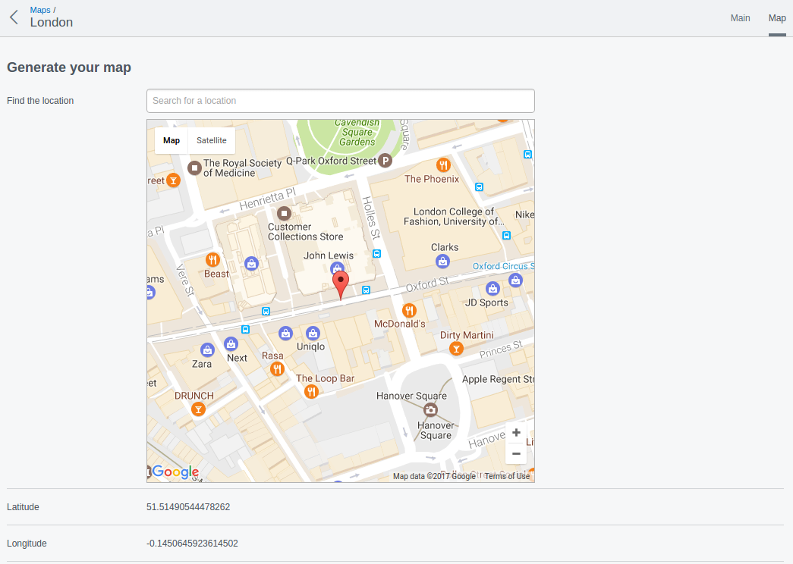

# Getting Started With The Google Maps Module

## Get An API Key

In order to use this module you need an [API key](https://developers.google.com/maps/documentation/javascript/get-api-key)
from Google.

Once you have this you will need to add it to "Settings" (via the left hand nav in the CMS).

## Setting Up Maps

Now log into the CMS, then visit Pages.

Select a page to add your Map to and cick the "Settings" tab.

An "Enable maps" option will be available, select and then save. Now open the "Content"
tab and use the maps sub tab.

Now go to the "Content" tab and select the "Maps" tab.

From here, add or edit maps you want to appear. You can then enter the location details:

And also place a pin on the location:

## Add Maps To Your Template

Next add $GoogleMaps template variable to your page template (where you want the maps to appear).

Review on screen and code CSS for the right look and feel.